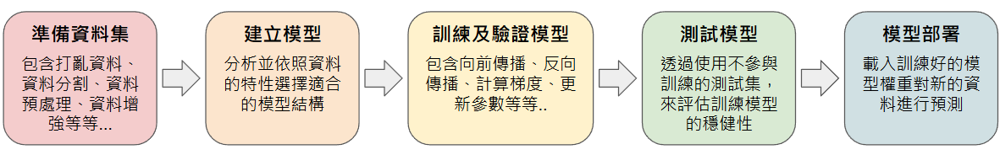
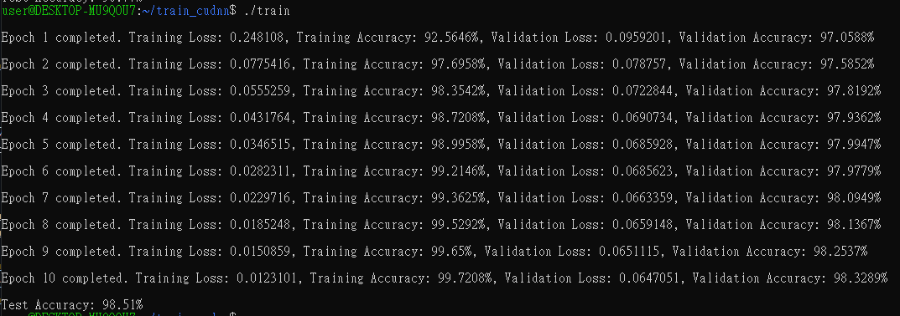

# Exploring GPU-Accelerated CNN Training Using CUDA cuDNN and cuBLAS

## 概述

這個side project是我學習 NVIDIA DLI 的「Getting Started with Accelerated Computing in CUDA C/C++」以及「Fundamentals of Accelerated Computing with CUDA Python」的延伸。在完成這兩門課程後，我對 GPU 編程產生了極大的興趣，並開始在網上深入學習，探索更多可能性。

直到有一天我在網上發現了周斌老師的 CUDA 教學課程。在最後幾節課中，老師簡略介紹如何使用 CUDA 和 cuDNN 應用於 CNN。然而，我發現網上似乎缺乏從零開始使用 cuDNN 和 CUDA 建立自己的 CNN 模型並進行訓練和預測的完整資源。這也成為我製作這個side project的動機。

這個專案不僅讓我重新複習了深度學習的相關概念，也學會了如何從底層開始，手動優化每一個步驟，這讓我對背後的運作機制有了更深的理解。同時也更加體會到，以前只需透過幾行 PyTorch 或 TensorFlow 程式碼就能使用 GPU 加速的方便，其實是一件非常幸福的事。

另外，我還是 CUDA 這方面的新手，若有錯誤請通知我，我會盡快修正！

## 詳細說明

這個專案主要使用 **CUDA**、**cuDNN** 以及 **cuBLAS** 來進行 CNN 模型的訓練與測試。由於是初次使用，因此我參考了 [Convolutions with cuDNN](https://www.goldsborough.me/cuda/ml/cudnn/c++/2017/10/01/14-37-23-convolutions_with_cudnn/) 建立了一個沒有池化層的簡單 CNN 模型架構，包括：

- **兩個捲積層**：
  - **第一層**：32 個 5×5 的 filters
  - **第二層**：64 個 5×5 的 filters
- **扁平層**
- **Softmax 輸出層**

一般在使用像 TensorFlow 和 PyTorch 這些深度學習框架進行模型訓練時，通常需要經過以下步驟：



使用這些常見的深度學習框架來建立這個簡易模型，不需要太多程式碼就能實作。以下是使用 TensorFlow 和 PyTorch 實作這個簡易模型的範例。

### TensorFlow 範例

```python
import tensorflow as tf
from tensorflow.keras import layers, models
from tensorflow.keras.datasets import mnist
from tensorflow.keras.utils import to_categorical

# 載入 MNIST 資料集
(train_images, train_labels), (test_images, test_labels) = mnist.load_data()

# 資料預處理部分
train_images = train_images.reshape((60000, 28, 28, 1)).astype('float32') / 255
test_images = test_images.reshape((10000, 28, 28, 1)).astype('float32') / 255

# 將標籤轉換為 one-hot encoding
train_labels = to_categorical(train_labels)
test_labels = to_categorical(test_labels)

# 建立 CNN 模型
model = models.Sequential(
    [
        # 第一個卷積層: 定義 32 個 5 * 5 的 filters，input_shape 為 (28, 28, 1)
        layers.Conv2D(32, (5, 5), padding='same', activation='relu', input_shape=(28, 28, 1)),

        # 第二個卷積層: 定義 32 個 5 * 5 的 filters
        layers.Conv2D(64, (5, 5), padding='same', activation='relu'),

        # 扁平層: 將卷積層變成一維向量，以便輸入進全連接層
        layers.Flatten(),

        # 全連接層: 使用 Softmax 將輸出轉換為 10 個概率分佈，對應0-9的數字分類
        layers.Dense(10, activation='softmax'),
    ]
)

# 編譯模型(設定optimizer, loss function和metrics)
model.compile(optimizer=tf.keras.optimizers.SGD(learning_rate=0.001), loss='categorical_crossentropy', metrics=['accuracy'])

# 訓練模型
model.fit(train_images, train_labels, epochs=10, batch_size=64, validation_split=0.2)

# 評估模型
test_loss, test_acc = model.evaluate(test_images, test_labels)

# 輸出測試 accuracy
print(f'Test Accuracy: {test_acc * 100:.2f}%')

```

### PyTorch 範例

```python
import torch
import torch.nn as nn
import torch.optim as optim
from torchvision import datasets, transforms
from torch.utils.data import DataLoader, random_split

# 確認是否有可用的GPU
device = torch.device("cuda" if torch.cuda.is_available() else "cpu")
print(f'Device: {device}')

# 定義資料預處理
transform = transforms.Compose([
    transforms.ToTensor(),         # 將圖片轉為 Tensor
    transforms.Normalize((0.5,), (0.5,))  # 均值為0.5，標準差為0.5
])

# 載入 MNIST 資料集
full_train_dataset = datasets.MNIST(
    root='./data',          # 指定資料集下載和存儲的目錄
    train=True,             # 指定載入訓練資料集
    download=True,          # 如果資料集尚未下載，則下載
    transform=transform     # 應用前面定義的轉換
)

test_dataset = datasets.MNIST(
    root='./data',
    train=False,            # 指定載入測試資料集
    download=True,
    transform=transform
)

# 將資料集分割成訓練集和驗證集
validation_split = 0.2  # 20%的資料作為驗證集
train_size = int((1 - validation_split) * len(full_train_dataset))
val_size = len(full_train_dataset) - train_size
train_dataset, val_dataset = random_split(full_train_dataset, [train_size, val_size])

# 使用 DataLoader 包裝資料集，方便迭代訓練
train_loader = DataLoader(
    train_dataset,          
    batch_size=64,          
    shuffle=True            
)

val_loader = DataLoader(
    val_dataset,            
    batch_size=64,          
    shuffle=False           
)

test_loader = DataLoader(
    test_dataset,
    batch_size=100,         
    shuffle=False           
)

# 定義 CNN 模型
class CNN(nn.Module):
    def __init__(self):
        super(CNN, self).__init__()
        # 第一個卷積層: 定義 32 個 5 * 5 的 filters，input_shape 為 (28, 28, 1)
        self.conv1 = nn.Conv2d(in_channels=1, out_channels=32, kernel_size=5, padding=2)
        self.relu1 = nn.ReLU()
        
        # 第二個卷積層: 定義 32 個 5 * 5 的 filters
        self.conv2 = nn.Conv2d(in_channels=32, out_channels=64, kernel_size=5, padding=2)
        self.relu2 = nn.ReLU()
        
        # 扁平層: 將卷積層變成一維向量，以便輸入進全連接層
        self.flatten = nn.Flatten()
        
        # 全連接層: 使用 Softmax 將輸出轉換為 10 個概率分佈，對應0-9的數字分類
        self.fc = nn.Linear(in_features=64 * 28 * 28, out_features=10)
        self.softmax = nn.Softmax(dim=1)
    
    # 定義前向傳播過程
    def forward(self, x):          
        x = self.relu1(self.conv1(x))  
        x = self.relu2(self.conv2(x))  
        x = self.flatten(x)             
        x = self.fc(x)                  
        x = self.softmax(x)             
        return x

model = CNN().to(device)  # 使用 GPU 加速 CNN 模型

# 定義 loss function 和 optimizer 
criterion = nn.CrossEntropyLoss()
optimizer = optim.SGD(model.parameters(), lr=0.001)

# 訓練模型
num_epochs = 10  
for epoch in range(num_epochs):
    model.train()  
    train_loss, train_correct, train_total = 0.0, 0, 0   # 計算訓練損失，正確的數量，總樣本數
    
    for images, labels in train_loader:
        images, labels = images.to(device), labels.to(device)  # 將訓練資料移動到 GPU
        
        optimizer.zero_grad()         # 清空之前計算的梯度
        outputs = model(images)       # 前向傳播取得模型輸出
        loss = criterion(outputs, labels)  # 計算 loss
        loss.backward()             # 反向傳播計算梯度
        optimizer.step()             # 更新模型參數
        
        train_loss += loss.item() * images.size(0) # 乘以批次大小來得到總 loss 值
        _, predicted = torch.max(outputs.data, 1)   # 預測結果：取最大概率的類別
        train_total += labels.size(0)             # 累積總樣本數
        train_correct += (predicted == labels).sum().item() # 累積正確預測的數量
    
    # 訓練的平均 loss 和 accuracy
    train_loss = train_loss / train_total
    train_acc = train_correct / train_total * 100
    
    # 驗證模型
    model.eval()
    val_loss, val_correct, val_total = 0.0, 0, 0  # 計算驗證損失，正確的數量，總樣本數
    
    with torch.no_grad():  # 驗證不需要計算梯度
        for val_images, val_labels in val_loader:
            val_images, val_labels = val_images.to(device), val_labels.to(device)  # 將驗證資料移動到 GPU
            val_outputs = model(val_images)                      # 前向傳播取得模型輸出
            loss = criterion(val_outputs, val_labels)                 # 計算 loss
            val_loss += loss.item() * val_images.size(0)              # 累積損失
            _, val_predicted = torch.max(val_outputs.data, 1)            # 預測結果：取最大概率的類別
            val_total += val_labels.size(0)                      # 累積總樣本數
            val_correct += (val_predicted == val_labels).sum().item()        # 累積正確預測的數量
    
    # 驗證的平均 loss 和 accuracy
    average_val_loss = val_loss / val_total
    val_accuracy = val_correct / val_total * 100
    
    # 輸出整個 epoch 的訓練和驗證結果
    print(f'Epoch {epoch+1}:')
    print(f'  Training   - Loss: {train_loss:.4f}, Accuracy: {train_acc:.2f}%')
    print(f'  Validation - Loss: {average_val_loss:.4f}, Accuracy: {val_accuracy:.2f}%')

# 評估模型在測試集上的表現
model.eval()  
test_correct, test_total = 0, 0     # 正確預測和總樣本數

with torch.no_grad():  # 測試不需要計算梯度
    for images, labels in test_loader:
        images, labels = images.to(device), labels.to(device) # 將測試資料移動到 GPU
        outputs = model(images)                 # 前向傳播取得模型輸出
        _, predicted = torch.max(outputs.data, 1)       # 預測結果：取最大概率的類別
        test_total += labels.size(0)             # 累積總樣本數
        test_correct += (predicted == labels).sum().item()  # 累積正確預測的數量

# 計算測試集的 accuracy
test_acc = test_correct / test_total * 100
print(f'\nTest Accuracy: {test_acc:.2f}%')

```

可以看到，使用 TensorFlow 只需建立好模型並編譯後，就能自動完成向前傳播、反向傳播、計算梯度和更新參數等操作。PyTorch 稍微複雜一些，需要手動呼叫這些操作函數，但整體而言也相當簡潔，程式碼（不含註解）約在 150 行以內。

但在使用 **CUDA**、**cuDNN** 及 **cuBLAS** 時，我們需要進行以下步驟：

1. **初始化和資源分配**：建立 cuDNN 和 cuBLAS 的 handle 以管理狀態和資源。
2. **定義模型結構**：使用 Descriptor 設定輸入、卷積、輸出等操作細節。
3. **初始化模型參數**：隨機初始化權重和偏差，並將其傳輸到 GPU。
4. **向前傳播**：使用 cuDNN 的卷積函數和 cuBLAS 建立全連接層來實現前向傳播。
5. **計算 Loss 和 Accuracy**：手動計算損失和評估準確率。
6. **反向傳播**：使用 cuDNN 的反向卷積函數和 cuBLAS 計算梯度。
7. **參數更新**：使用自定義的 CUDA Kernel（如 SGD）函數進行參數更新。
8. **測試模型**：使用前向傳播評估模型的表現。
9. **釋放資源**：釋放所有分配的 GPU 記憶體和 cuDNN/cuBLAS 資源。

雖然 **CUDA**、**cuDNN** 及 **cuBLAS** 具有高度的靈活性，但需要手動管理所有操作和記憶體，並定義每一層的操作和連接，因此程式碼會相對多且複雜。

在這個專案中，我將整個訓練模型的過程分成以下的文件結構：

```
- datasets/            # MNIST 資料集（二進制）
  - train-images.idx3-ubyte  # 訓練資料集圖片
  - train-labels.idx1-ubyte  # 訓練資料集標籤
  - t10k-images.idx3-ubyte   # 測試資料集圖片
  - t10k-labels.idx1-ubyte   # 測試資料集標籤

- test_images/         # 用於 predict.cu 進行模型預測的圖片

- weights/             # 用於儲存訓練好的模型權重

- utils.cuh            # 包含各種函式宣告和 CUDA Kernel 函式原型

- utils.cu             # 實現 utils.cuh 中的函式

- main.cu              # 負責整個訓練過程的管理和執行

- predict.cu           # 用於進行模型預測和評估，使用訓練好的模型權重進行推理和測試
```

詳細的程式說明我會放在以下這個連結：[Notion（尚未更新完）](https://hurricane-silkworm-61b.notion.site/CUDA-cudnn-116f7e11c54d807eb525f18035c4aea9?pvs=4)。

## 如何運行

請按照以下步驟運行此程式：

### 1. 建立環境

在 Windows 10 上使用 WSL2 建立一個 Ubuntu 22.04 的開發環境，並安裝以下開發套件：

1. **CUDA Toolkit**：12.6
2. **cuDNN**：9.4.0
3. **OpenCV**：4.5.4

### 2. 下載專案

```sh
git clone https://github.com/iamrock123/Exploring-GPU-Accelerated-CNN-Training-Using-CUDA-cuDNN-and-cuBLAS.git
```

### 3. 編譯專案

在專案目錄下輸入以下指令編譯程式：

```sh
cd <請填入專案路徑>
make
```

若要重新編譯，請先輸入 `make clean`，再重新執行 `make`。

### 4. 開始訓練和預測

#### 訓練模型

輸入以下指令進行模型訓練：

```sh
./train
```

執行成功會出現訓練和驗證的結果，最後進行測試，訓練好的權重會自動儲存在 `weights` 資料夾中。



#### 進行預測

使用訓練好的模型權重進行預測，以下以 `0.png` 這張測試圖片為例：

```sh
./predict ./testImages/0.png
```

執行成功會出現預測的結果：


## 小結

透過這次開發 **CUDA**、**cuDNN** 以及 **cuBLAS** 的經驗，讓我更了解實際使用 NVIDIA 顯示卡來對模型訓練進行加速。雖然感覺程式還有許多可以優化的地方（如向前傳播和反向傳播），但近期收到 Nvidia 與 LamaIndex 的競賽通知，未來希望透過設計好程式的功能，將這些傳播包裝起來，並加入池化層，建立一個完整的 CNN 模型。

## 參考資料

- [Fundamentals of Accelerated Computing with CUDA C/C++](https://learn.nvidia.com/courses/course-detail?course_id=course-v1:DLI+C-AC-01+V1)
- [Fundamentals of Accelerated Computing with CUDA Python](https://learn.nvidia.com/courses/course-detail?course_id=course-v1:DLI+C-AC-02+V1)
- [vhall415/gpu_cnn](https://github.com/vhall415/gpu_cnn)
- [cuda-toolkit](https://developer.nvidia.com/cuda-toolkit)
- [cuDNN](https://developer.nvidia.com/cudnn)
- [cuBLAS](https://developer.nvidia.com/cublas)

---

*感謝您查看此專案！如果有任何建議或改進，歡迎開啟議題。*

